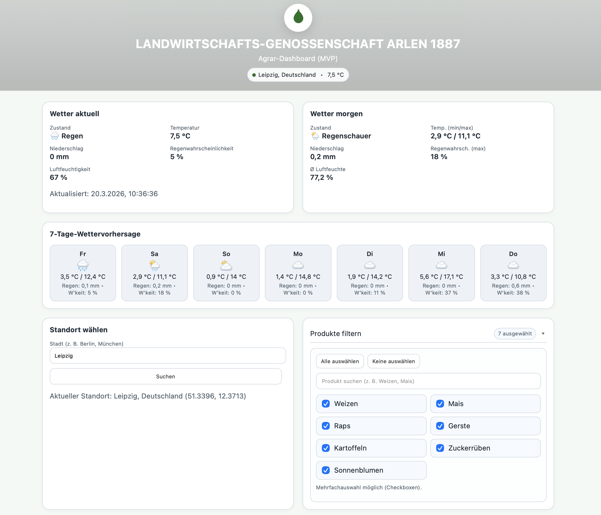
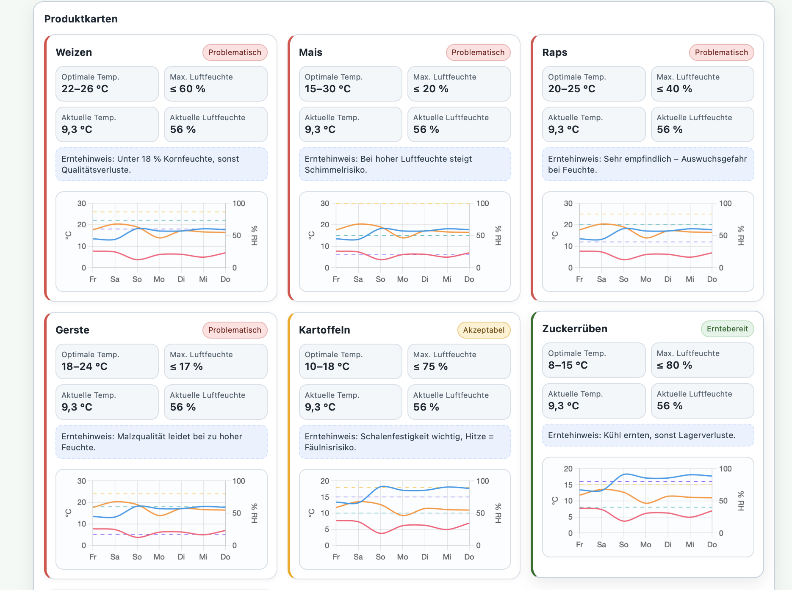

# AGRA Dashboard - Agriculture Analytics MVP

> **Interactive agriculture dashboard with real-time weather data, crop monitoring, and 7-day forecasts -- built as a team project during the CloudHelden bootcamp.**

[](https://developer.mozilla.org/en-US/docs/Web/JavaScript)
[](https://www.docker.com/)
[](LICENSE)

**Live Demo:** [agra.his4irness-n8n.tech](https://agra.his4irness-n8n.tech)



---

## Table of Contents

- [Overview](#overview)
- [Screenshots](#screenshots)
- [Features](#features)
- [Tech Stack](#tech-stack)
- [Project Structure](#project-structure)
- [Getting Started](#getting-started)
- [Deployment](#deployment)
- [Author](#author)

---

## Overview

AGRA Dashboard is a static MVP for an agricultural cooperative ("Landwirtschafts-Genossenschaft Arlen 1887"). It visualizes real-time weather conditions and evaluates crop health based on temperature and humidity thresholds.

Built as a team project during the CloudHelden bootcamp -- my first web development project, focused on learning HTML, CSS, JavaScript, and containerized deployment with Docker.

### What it does

- Fetches live weather data via Open-Meteo API (no API key required)
- Displays current conditions, tomorrow's forecast, and a 7-day outlook
- Monitors 7 crop types with optimized growing conditions
- Color-coded status indicators: optimal, acceptable, problematic, harvest-ready
- Interactive charts showing temperature and humidity trends per crop

---

## Screenshots

| Weather Overview | Crop Monitoring |
|-----------------|-----------------|
|  |  |

---

## Features

- **Real-time weather** -- current conditions with temperature, humidity, precipitation, and rain probability
- **7-day forecast** -- daily weather cards with weather icons and detailed metrics
- **Crop monitoring** -- 7 products (wheat, corn, rapeseed, barley, potatoes, sugar beets, sunflowers) with optimal ranges
- **Status indicators** -- color-coded borders (green/yellow/red/blue) based on current vs. optimal conditions
- **Harvest alerts** -- contextual tips per crop (e.g., "Kornfeuchte unter 18%, sonst Qualitätsverluste")
- **Trend charts** -- 7-day temperature and humidity graphs per crop using Chart.js
- **Location search** -- geocoding via Open-Meteo API, switch between cities
- **Product filter** -- checkbox-based multi-select to focus on specific crops
- **Responsive design** -- works on desktop, tablet, and mobile
- **Dark and light theme** -- separate stylesheets

---

## Tech Stack

| Component | Technology |
|-----------|-----------|
| Frontend | HTML5, CSS3, JavaScript (ES6+) |
| Charts | Chart.js |
| Weather API | Open-Meteo (free, no API key) |
| Containerization | Docker + nginx |
| Dev Server | Docker Compose |

---

## Project Structure

```
agra-dashboard/
├── Mockup/              # Initial HTML/CSS prototype
│   ├── index.html
│   └── styles.css
├── mvp/                 # Containerized MVP (production)
│   ├── public/
│   │   ├── index.html
│   │   ├── app.js       # Weather API, crop logic, charts
│   │   ├── styles.css
│   │   └── styles-light.css
│   ├── Dockerfile
│   ├── docker-compose.yml
│   ├── nginx.conf
│   └── README.md
└── Test/                # Early experiments
    ├── index.html
    ├── app.js
    └── styles.css
```

---

## Getting Started

### Prerequisites

- **Docker** (or Podman)

### Run locally

```bash
cd mvp
docker compose up --build
# Open: http://localhost:8080
```

---

## Deployment

### Docker

```bash
cd mvp
docker build -t agra-dashboard:latest .
docker run --rm -p 8080:80 agra-dashboard:latest
```

### AWS Options

- **S3 + CloudFront** -- upload `mvp/public/` contents to S3, serve via CloudFront (recommended for static sites)
- **ECS Fargate** -- push Docker image to ECR, run as Fargate service behind ALB

---

## Author

**Andy Schlegel**
Cloud & DevOps Engineer

- GitHub: [@AndySchlegel](https://github.com/AndySchlegel)

---

**Project Status:** MVP complete. Live demo running.
**Context:** Team project during CloudHelden Java DevOps Engineer bootcamp (2025).
